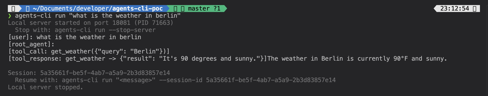
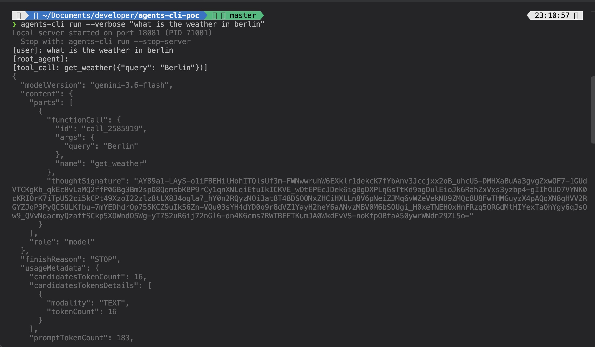
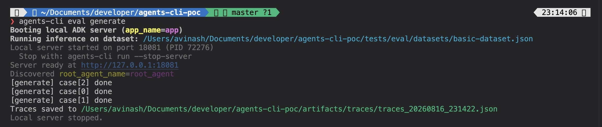
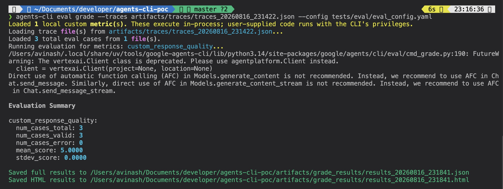
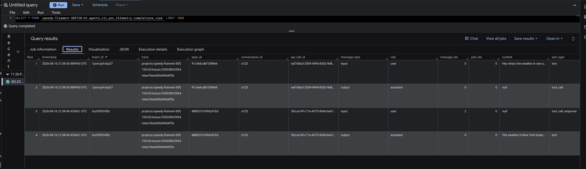
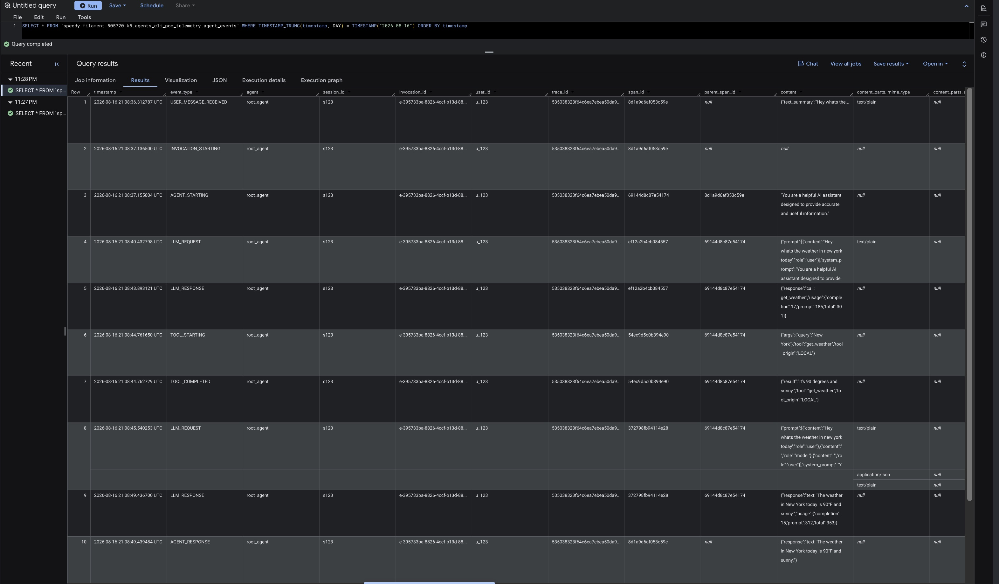

# Findings

## Development
Verify performance on a single user prompt
<p align="center">
  
</p>

<p align="center">
  
</p>

Verify performance on a multiple user prompts
<p align="center">
  
</p>
<p align="center">
  
</p>

Verify performance between two system prompts
```bash
agents-cli eval compare artifacts/grade_results/results_20260816_231841.json artifacts/grade_results/results_20260816_232121.json >> diff.json
```

## Troubleshooting and evals
Trace content stored in GCS, complete overview in Bigquery table via object tables
<p align="center">
  
</p>

ADK Bigquery analytics plugin with detailed agent information
<p align="center">
  
</p>